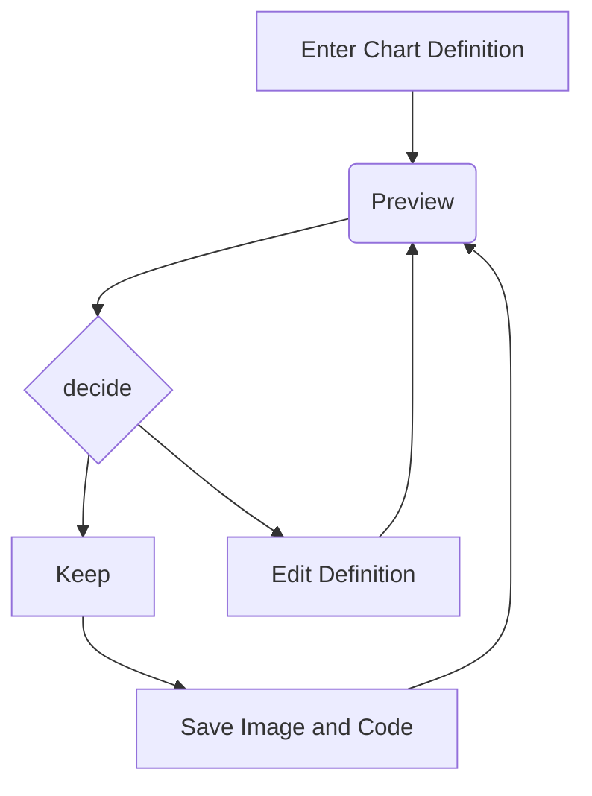
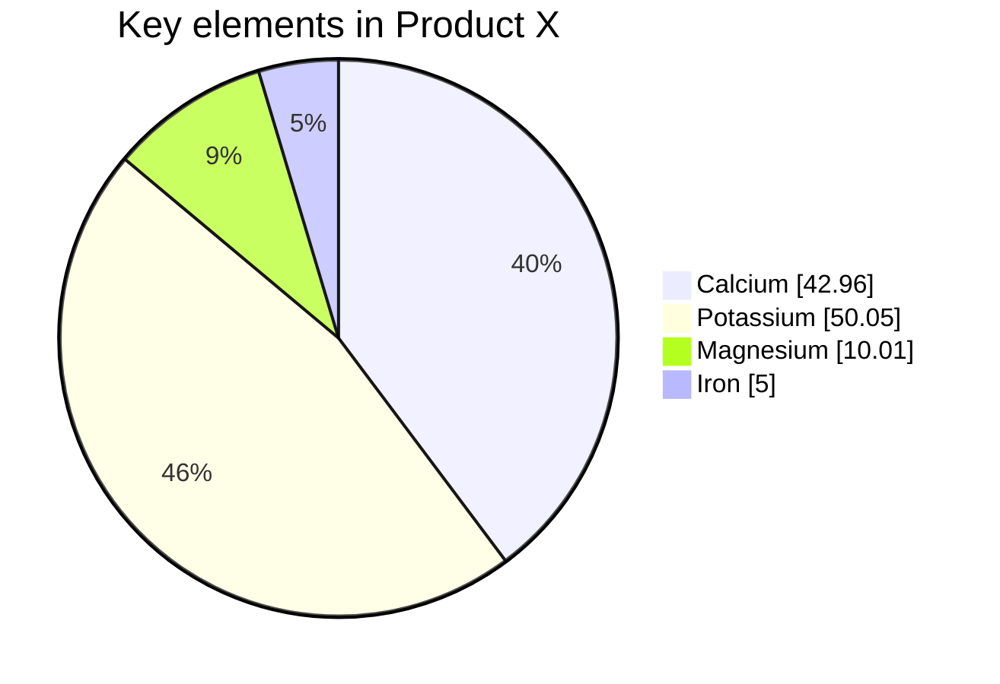

# 一级标题
## 二级标题
### 三级标题
#### 四级标题
##### 五级标题

# 分割线
-------------

普通内容

**粗体内容**

*斜体内容*

> 引用
>
> 引用
>
> > 嵌套引用
> >
> > 嵌套引用
> >
> > > 嵌套引用
> > >
> > > 嵌套引用

- 无序列表
- 无序列表
- 无序列表
- 无序列表

1. 有序列表
2. 有序列表
3. 有序列表

`行内代码`

整段代码
```html
  <div id="access-tags">
    <div class="panel-heading">热门标签</div>
    <div class="d-flex flex-wrap mt-3 mb-1 mr-3">
      <a class="post-tag" href="/tags/%E6%B5%8B%E8%AF%95/">测试</a>
    </div>
  </div>
```

```cpp
#include<iostream>
using namespace std;

int main(){
  cout << "hello world!" << endl;
  return 0;
}
```

行内数学公式

$e_{\text{man}}-e_{\text{woman}}\approx\ e_{\text{king}}- e_{?}$

${\tilde{c}}^{< t >} = tanh(W_{c}\left\lbrack a^{< t - 1>},x^{< t >} \right\rbrack +b_{c}$

整段数学公式

$$
{\tilde{c}}^{< t >} = tanh(W_{c}\left\lbrack a^{< t - 1>},x^{< t >} \right\rbrack +b_{c}
$$

$$
e_{\text{king}} - e_{\text{queen}} = \begin{bmatrix}
 - 0.95 \\
     0.93 \\
       0.70 \\
       0.02 \\
       \end{bmatrix} - \begin{bmatrix}
       0.97 \\
       0.95 \\
       0.69 \\
       0.01 \\
       \end{bmatrix} = \begin{bmatrix}
 - 1.92 \\
 - 0.02 \\
     0.01 \\
       0.01 \\
       \end{bmatrix} \approx \begin{bmatrix}
 - 2 \\
     0 \\
       0 \\
       0 \\
       \end{bmatrix}
$$

mermaid流程图





图片测试

{: .shadow }
_码农meme_

图片设置大小

{: width="100" height="100" }{: .shadow }
_码农meme_

左对齐

{: width="972" height="589" .w-75 .normal}
_码农meme_

左浮动

{: width="200" height="200" .w-70 .left}
Praesent maximus aliquam sapien. Sed vel neque in dolor pulvinar auctor. Maecenas pharetra, sem sit amet interdum posuere, tellus lacus eleifend magna, ac lobortis felis ipsum id sapien. Proin ornare rutrum metus, ac convallis diam volutpat sit amet. Phasellus volutpat, elit sit amet tincidunt mollis, felis mi scelerisque mauris, ut facilisis leo magna accumsan sapien. In rutrum vehicula nisl eget tempor. Nullam maximus ullamcorper libero non maximus. Integer ultricies velit id convallis varius. Praesent eu nisl eu urna finibus ultrices id nec ex. Mauris ac mattis quam. Fusce aliquam est nec sapien bibendum, vitae malesuada ligula condimentum.


> 信息
{: .prompt-info }

> 提示
{: .prompt-tip }

> 警告
{: .prompt-warning }

> 危险
{: .prompt-danger }

表格

| Company                      | Contact          | Country |
|:-----------------------------|:-----------------|--------:|
| Alfreds Futterkiste          | Maria Anders     | Germany |
| Island Trading               | Helen Bennett    | UK      |
| Magazzini Alimentari Riuniti | Giovanni Rovelli | Italy   |


ToDo list

- [ ] Job
  + [x] Step 1
  + [x] Step 2
  + [ ] Step 3